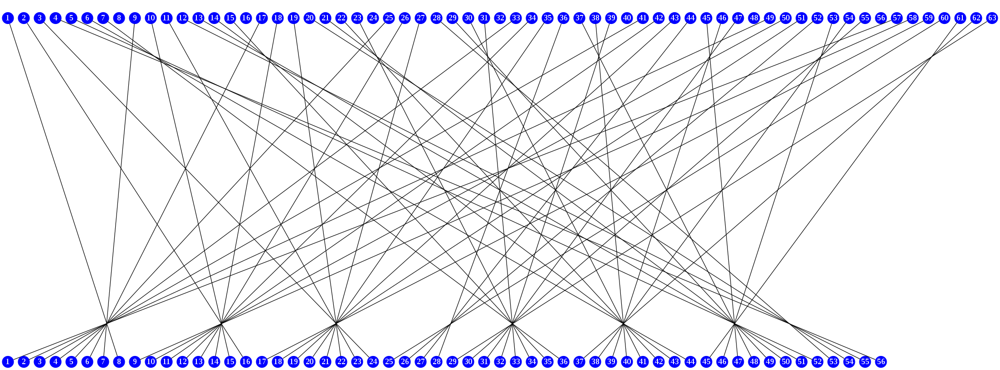
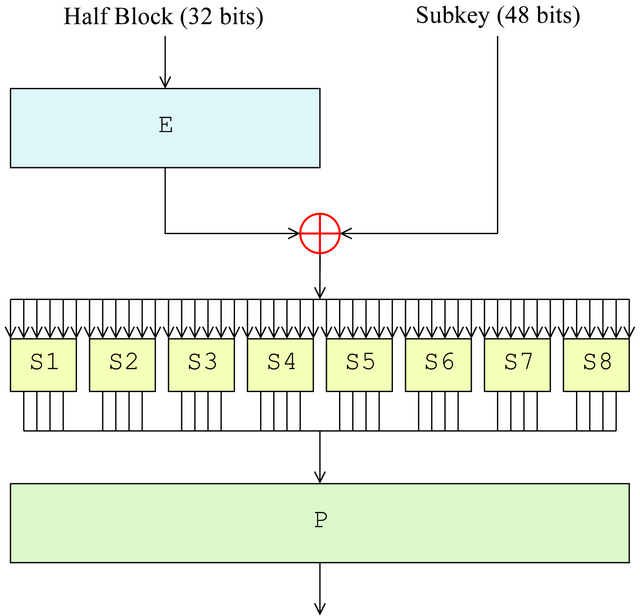
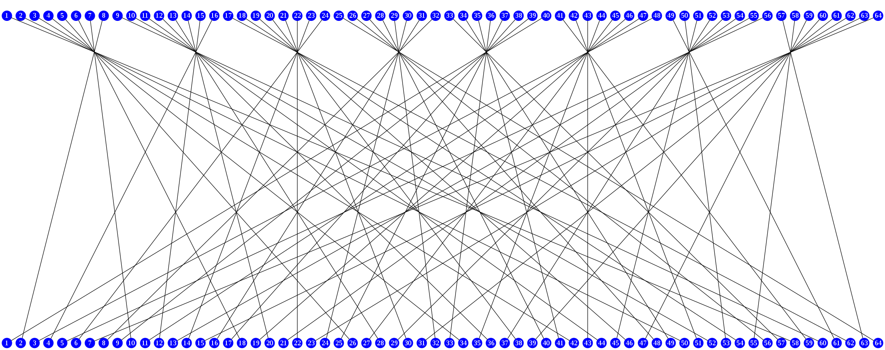

# 结构


> 引用自 https://ctf-wiki.github.io/ctf-wiki/crypto/blockcipher/des/

在这里，我们建立一个 `DES` 对象，并在对象中进行各种操作。输入和输出只有明文、密文和密钥。

首先，从输入起始 64 位的明文块到最后的输出，其中间过程，我们用 `bitset<n>` 这个 STL 库保存。

由于加密与解密过程中使用的算法相同，只是使用子密钥的次序相反，因此我们可以先实现加密算法，再对其修改使之通用，可以减少代码量，优化代码。

在处理数据之前（或者说同时），我们要对密钥进行处理，生成子密钥 $K_i$ 。

# 生成子密钥模块

输入 64 位密钥，但只使用前 56 位。在这里我们不检查奇偶校验位。

选择置换 $PC-1$ 用于去掉密钥 `k` 中的 8 个奇偶校验位，并对其余的 56 位打乱重新排列。



> 选择置换1 PC-1 [^1]

相关函数：

```c++
void GenerateKey();
bitset<28> LeftShift(bitset<28> bits, int times);
bitset<64> String2Bitset(string str);
```

# 加密模块

首先通过初始置换 IP 对 x 进行换位处理。


> 初始置换 IP [^2]

接着进行 16 轮如图所示的迭代


> DES 整体结构 [^3]

 其中 F 函数的结构如图所示：



> F 函数 [^4]

其输出最后再经过逆初始置换（也有称最终置换$IP^{-1}$）得到最终的密文 `CypherText`。

逆初始置换图形化如下：



> 逆初始置换 [^5]

 # 相关函数

## String2Bitset()

### 格式

```c++
bitset<64> String2Bitset(string str);
```

### 功能

输入长度任意的 `string`，输出长度为 64 位的 `bitset`。

### 处理方式

使用 `STL string` 进行初始化，其内容是 01 序列，因此该函数将输入的字符串转换为 01 序列再初始化。

对于长度大于等于 8 的字符串，只取前 8 位，每一位转换为 8 位二进制数字。

对于长度小于 8 位的字符串，其内容初始化结束后，前面补充长度为 `8x(8-str.length())` 的 0 。

### 特性

对于 `bitset<n>` 来说，如果初始化的长度大于 n，只有前 n 位会被赋值。而初始化的长度小于 n，则只有 `bitset<n>[0~n-1]` 会被赋值。

除此之外，对于 `bitset` 而言，它的`[i]` 是从后向前输出的。

例如对 `bitset<2> a="01"`，`a[0]=1`，`a[1]=0`。这也是需要注意的一点。

例如，输入为 `1234567890` （$n\geq 8$），经过该函数后的输出为：

```
00111000 00110111 00110110 00110101 00110100 00110011 00110010 00110001
```

而字符 `1` 的 hex 值为 0x31，即 $(00110001)_2$。

输入为 `123` （$n<8$）的输出为：

```
0000000000000000000000000000000000000000 00110011 00110010 00110001
```

### 代码

```c++

```

## GenerateKey()

### 格式

```c++
void GenerateKey();
```

### 功能

对 DES 模块中输入的 `string Key` 进行初始化，生成 16 个子密钥。

### 处理方式

首先将密钥由 `string` 格式转为 `bitset<64>` 格式。再对其进行 `PC-1` 的选择置换。由于 `bitset` 的特性，初始的选择方式 `K_56[i] = K_64[PC_1[i]]` 需要略作修改。修改后的结果为 `KeyBit56[55 - i] = KeyBit64[64 - PC_1[i]];`。

例如，输入为

```
00110001 "1"
00110010
00110011
00110100
00110101
00110110
00110111
00111000 "8"
```

的输出是：

```
00000000 \
00000000    KeyBit56[28~55]
11111111    C[0:27:1] = KeyBit56[55:28:-1]
1111     /
    0110 \
01100111    KeyBit56[0~27]
10001000    D[0:27:1] = KeyBit56[27:0:-1]
00001111 /
```

接下来选取 C 和 D。

然后开始 16 次迭代。每次迭代首先对 $C_i$、$D_i$ 进行循环左移，得到 $C_{i+1}$、$D_{i+1}$。再将$C_{i+1}$、$D_{i+1}$ 合并得到 $KeyBit56_{i}$，$(0<i<17)$。接着对其进行 `PC-2` 的选择置换，最后得到一个长度为 48 bit 的 $SubKey_i$。

进行 `PC-2` 的选择置换时有：`SubKey[round][i] = KeyBit56[PC_2[i]]`。我们稍作修改有：`SubKey[round][47 - i] = KeyBit56[56-PC_2[i]]`。

### 代码

```c++

```

## LeftShift()

### 格式

```c++
bitset<28> LeftShift(bitset<28> bits, int times)
```

### 功能

输入一串 `bitset<28>` 格式的序列，进行 DES 逻辑上的循环左移，之后输出。

### 处理方式

例如输入的是 `bitset: 0011000111, times = 1`，实际上正常的顺序应该是 `1110001100` ，循环左移的结果应当为 `1100011001` 。而这里我们按照 `bitset` 的输出应当为 `1001100011`，恰好相当于循环右移。也就是说：
$$
ret = input<<(28-times)|input>>times
$$

### 代码

```c++

```

# 关于

[^1]: https://zh.wikipedia.org/wiki/DES%E8%A1%A5%E5%85%85%E6%9D%90%E6%96%99
[^2]: 见[^1]
[^3]: https://zh.wikipedia.org/wiki/%E8%B3%87%E6%96%99%E5%8A%A0%E5%AF%86%E6%A8%99%E6%BA%96#%E6%95%B4%E4%BD%93%E7%BB%93%E6%9E%84
[^4]: https://zh.wikipedia.org/wiki/%E8%B3%87%E6%96%99%E5%8A%A0%E5%AF%86%E6%A8%99%E6%BA%96#%E8%B2%BB%E6%96%AF%E5%A6%A5%E5%87%BD%E6%95%B0%EF%BC%88F%E5%87%BD%E6%95%B0%EF%BC%89
[^5]: [最终置换 (IP-1)](https://zh.wikipedia.org/wiki/DES%E8%A1%A5%E5%85%85%E6%9D%90%E6%96%99#%E6%9C%80%E7%BB%88%E7%BD%AE%E6%8D%A2_(IP-1))

